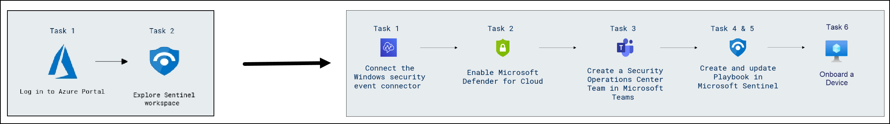

# Threat Protection with XDR - Review and explore sentinel workspace and Integrate Logic App with Threat Protection and XDR - 1 & 2
### Overall Estimated Duration: 150 minutes
## Overview

In this hands-on lab, you will explore the integration of Azure Sentinel, Microsoft Defender, and Logic Apps to enhance security operations and automate threat response. You will begin by reviewing and managing a pre-configured Azure Sentinel workspace, where you will investigate security incidents, configure automated responses, and analyze data to strengthen threat detection and response capabilities. Next, you will integrate Logic Apps with Threat Protection and Extended Detection and Response (XDR) solutions, enabling the creation of automated workflows and playbooks that streamline security alerts and actions. Additionally, you will configure connectors, onboard devices, and interact with Microsoft Defender for Cloud, providing you with practical experience in automating and centralizing threat intelligence and response.

## Objective

Understand how to manage security incidents and automate responses using Azure Sentinel, Logic Apps, and Microsoft Defender for Cloud. Gain skills in configuring connectors, creating playbooks, and integrating threat protection across your organization’s security operations. By the end of this lab, you will be able to:

- **Explore and Manage Azure Sentinel Workspace**: Learn to navigate and review a pre-configured Sentinel workspace to investigate security incidents, configure automated responses, and analyze data for threat detection.
- **Integrate Logic Apps with Threat Protection and XDR**: Understand how to automate threat detection and response workflows by integrating Logic Apps with Threat Protection and Extended Detection and Response (XDR) systems, including configuring triggers and actions.
- **Enable and Configure Microsoft Defender for Cloud**: Gain practical skills in enabling Microsoft Defender for Cloud, onboarding devices, and integrating them into the Sentinel workspace for real-time monitoring and incident management.
- **Create and Manage Security Playbooks**: Develop the ability to create and update playbooks within Microsoft Sentinel, streamlining automated responses to security incidents and alerts within your organization’s cloud environment.

## Pre-requisites

Participants should have:

- **Familiarity with Azure Sentinel and Defender for Cloud**: Understanding of Microsoft Sentinel and Microsoft Defender for Cloud capabilities, including security incident management and cloud security monitoring.
- **Experience with Azure Portal and Logic Apps**: Familiarity with navigating the Azure Portal and using Azure Logic Apps for automation and workflow management.
Basic Security Operations Knowledge: Proficiency in security operations, including working with security incidents, alerts, and configuring threat detection tools.
- **Basic Security Operations Knowledge**: Proficiency in security operations, including working with security incidents, alerts, and configuring threat detection tools.

## Architecture

In this hands-on lab, the architecture flow encompasses several key components essential for enhancing security operations. You will start by setting up an Azure Sentinel workspace and integrating Microsoft Defender for Cloud. At the core of the architecture is Azure Sentinel, which aggregates security data, manages incidents, and enables automated responses through Logic Apps. The integration of Microsoft Defender for Cloud enhances security posture by monitoring and protecting Azure resources. Logic Apps facilitate the automation of workflows, allowing for efficient handling of threat alerts and responses. Additionally, the architecture includes various connectors for data ingestion, such as the Windows Security Event Connector, enabling real-time monitoring of security incidents. This system promotes streamlined operations and effective threat management across the Azure environment.

## Architecture Diagram

## Explanation of Components

The architecture for this lab involves the following key components:

- **Azure Sentinel**: Azure Sentinel is a cloud-native SIEM (Security Information and Event Management) solution that provides intelligent security analytics and threat intelligence across your enterprise. It enables you to collect, analyze, and respond to security incidents in real time.
- **Microsoft Defender for Cloud**: This service enhances your security posture by providing continuous security assessment and recommendations for Azure resources, helping to protect against threats and vulnerabilities.
- **Logic Apps**: Azure Logic Apps is a cloud service that allows you to automate workflows and integrate applications and data across various systems. In this lab, it is used to create automated responses to security incidents and alerts.
- **Windows Security Event Connector**: This connector facilitates the collection of security events from Windows systems, enabling the monitoring and analysis of potential threats and incidents within the Azure environment.
- **Microsoft Teams**: Microsoft Teams serves as a collaboration platform where the Security Operations Center (SOC) team can communicate and manage alerts and incidents effectively, streamlining incident response efforts.
- **Playbooks in Microsoft Sentinel**: Playbooks are workflows built using Logic Apps that automate responses to incidents, allowing for quick and consistent actions based on predefined rules and conditions.

## Getting Started with the Lab
 
Welcome to your Threat protection with XDR workshop! We've prepared a seamless environment for you familiarize yourself with the Microsoft security operations analyst, you monitor, identify, investigate, and respond to threats in multicloud environments and related Microsoft services. Let's begin by making the most of this experience:
 
## Accessing Your Lab Environment
 
Once you're ready to dive in, your virtual machine and lab guide will be right at your fingertips within your web browser.
 

### Virtual Machine & Lab Guide
 
Your virtual machine is your workhorse throughout the workshop. The lab guide is your roadmap to success.
 
## Exploring Your Lab Resources
 
To get a better understanding of your lab resources and credentials, navigate to the **Environment Details** tab.
 

 
## Utilizing the Split Window Feature
 
For convenience, you can open the lab guide in a separate window by selecting the **Split Window** button from the Top right corner.
 

 
## Managing Your Virtual Machine
 
Feel free to start, stop, or restart your virtual machine as needed from the **Resources** tab. Your experience is in your hands!
 

## Lab validation

1. After completing the task, hit the Validate button under Validation tab integrated within your lab guide. If you receive a success message, you can proceed to the next task, if not, carefully read the error message and retry the step, following the instructions in the lab guide.

   

2. You can also validate the task by navigating to the Lab Validation tab, from the upper right corner in the lab guide section.

   

3. If you need any assistance, please contact us at labs-support@spektrasystems.com.

## Login to the Azure Portal
 
1. In the JumpVM, click on the Azure portal shortcut of the Microsoft Edge browser, which is created on the desktop.
 
    

2. On the Sign in to Microsoft Azure tab, you will see the login screen. Enter the following email or username, and click on Next.
 
   - **Email/Username:** <inject key="AzureAdUserEmail"></inject>
 
     
 
3. Next, provide your password:
 
   - **Password:** <inject key="AzureAdUserPassword"></inject>
 
     
 
4. If you see the pop-up Action Required, click Ask Later.

   

   > **NOTE**: Do not enable MFA, select Ask Later.

5. If you see the pop-up Stay Signed in?, select No.

6. If you see the pop-up **You have free Azure Advisor recommendations!**, close the window to continue the lab.

7. If a Welcome to **Microsoft Azure** popup window appears, select **Maybe Later** to skip the tour.

8. Now that you will see the Azure Portal Dashboard, click on Resource groups from the Navigate panel to see the resource groups.

     
 
In this hands-on lab, you'll explore Azure Sentinel and Microsoft Defender for Cloud while integrating Logic Apps for automated incident responses, enhancing your security operations and threat detection capabilities.

## Support Contact

The CloudLabs support team is available 24/7, 365 days a year, via email and live chat to ensure seamless assistance at any time. We offer dedicated support channels tailored specifically for both learners and instructors, ensuring that all your needs are promptly and efficiently addressed.

Learner Support Contacts:

 - Email Support: labs-support@spektrasystems.com
 - Live Chat Support: https://cloudlabs.ai/labs-support

Now, click on Next from the lower right corner to move on to the next page.

## Happy Learning!!
