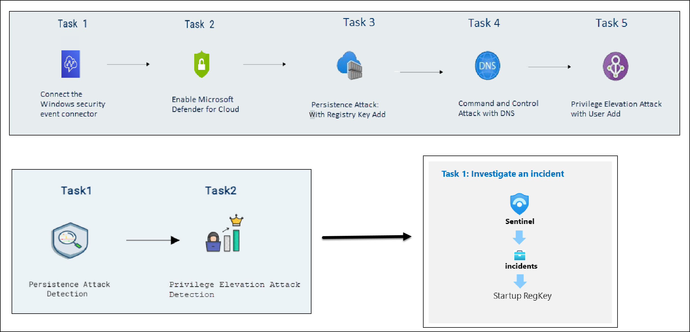
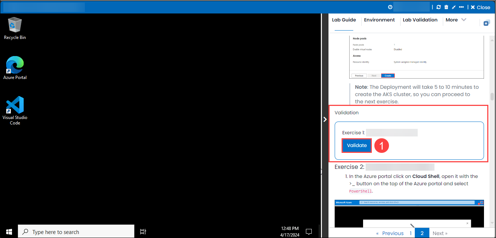
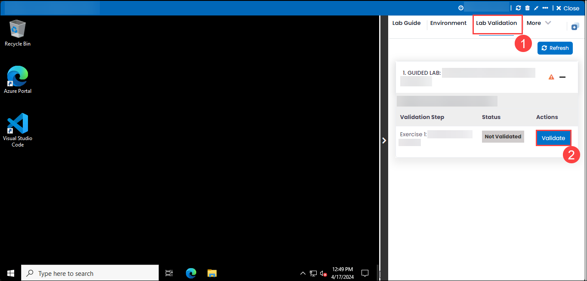
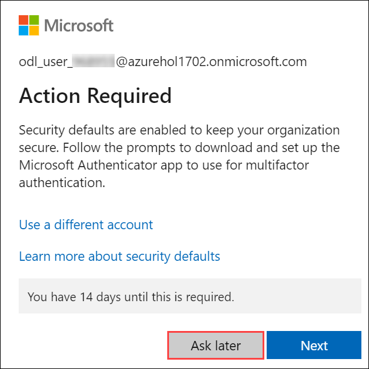
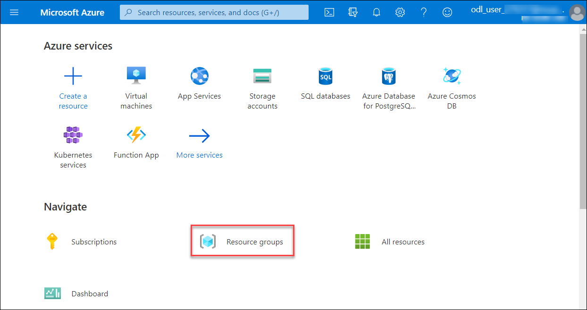

# Module - 03 : Threat Protection with XDR - Conduct attacks and Investigate an Incident
### Overall Estimated Duration: 140 minutes
## Overview

In this hands-on lab, you will explore the integration of Microsoft Sentinel, Microsoft Defender, and KQL-based detections to enhance security operations and automate incident investigation. You will begin by creating custom analytics rules in Microsoft Sentinel to detect persistence and privilege elevation attacks, using KQL queries to identify and respond to threats in your environment. Next, you will investigate incidents triggered by these rules, reviewing details, changing incident status, and executing automated responses with playbooks. This lab provides practical experience in building threat detections, automating alerts, and investigating incidents, helping you strengthen your organization’s security posture and response capabilities.

## Objective

Understand how to simulate and detect various cyber attacks using Microsoft Defender and Microsoft Sentinel. Gain skills in connecting Windows security events, performing attack simulations, and analyzing alerts. By the end of this lab, you will be able to:

- **Conduct Attacks**: Understand how to simulate various attacks to comprehend threat detection and investigation processes within Microsoft Defender. You will explore attack techniques like persistence and privilege escalation to enhance your knowledge of security operations.

- **Create Detections**: Gain skills in creating custom analytics rules using KQL queries to identify persistence and privilege elevation attacks. This lab will equip you with the ability to enhance your organization’s threat detection capabilities through effective monitoring and alerting.

- **Investigate an Incident**: Learn to analyze incidents by reviewing details, managing alerts, and running playbooks to automate response actions. This lab will provide you with practical experience in effective security incident management, ensuring a comprehensive approach to responding to threats.

## Pre-requisites

Participants should have:

- **Familiarity with Azure Sentinel and Microsoft Defender**: A basic understanding of Azure Sentinel and Microsoft Defender concepts, including incident management and threat detection.

- **Knowledge of KQL (Kusto Query Language)**: Familiarity with KQL for querying data within Azure Sentinel to create and analyze detection rules.

- **Basic Security Operations Understanding**: An understanding of common security incidents, including persistence and privilege escalation attacks, to effectively engage in lab activities.

## Architecture

In this hands-on lab, the architecture flow encompasses several essential components to enhance security operations. You’ll begin by setting up the Azure Sentinel workspace, which serves as the centralized hub for monitoring and managing security incidents. Integrated with Microsoft Defender for real-time threat detection and response, the architecture ensures comprehensive security coverage across cloud resources. Log Analytics plays a key role in querying and analyzing logs using KQL, enabling the creation of custom analytics rules for threat detection. Logic Apps automate workflows and responses, facilitating seamless orchestration of security actions based on detected incidents. This architecture also supports a user interaction layer where security analysts can review incidents, execute automated responses, and manage playbooks efficiently, ensuring a robust and responsive security posture throughout the organization.

## Architecture Diagram

## Explanation of Components

The architecture for this lab involves the following key components:

- **Microsoft Sentinel**: A scalable, cloud-native SIEM tool that provides intelligent security analytics, enabling the detection, investigation, and automated response to security incidents.

- **Microsoft Defender for Cloud**: Integrated threat protection platform that secures workloads in Azure and on-premises, detecting vulnerabilities and attacks in real time.

- **Logic Apps**: Cloud-based workflows that automate tasks and orchestrate processes for security incident responses within Sentinel, integrating with Defender and other services.

- **KQL Queries (Azure Monitor Logs)**: Kusto Query Language (KQL) is used to query data in Azure Monitor Logs for detecting anomalous activities or specific threat patterns.

- **Playbooks**: Playbooks are automated workflows built with Logic Apps that respond to detected threats by automating actions, helping with timely incident management.

## Getting Started with the Lab
 
Welcome to your Threat protection with XDR workshop! We've prepared a seamless environment for you familiarize yourself with the Microsoft security operations analyst, you monitor, identify, investigate, and respond to threats in multicloud environments and related Microsoft services. Let's begin by making the most of this experience:
 
## Accessing Your Lab Environment
 
Once you're ready to dive in, your virtual machine and lab guide will be right at your fingertips within your web browser.
 

### Virtual Machine & Lab Guide
 
Your virtual machine is your workhorse throughout the workshop. The lab guide is your roadmap to success.
 
## Exploring Your Lab Resources
 
To get a better understanding of your lab resources and credentials, navigate to the **Environment Details** tab.
 

 
## Utilizing the Split Window Feature
 
For convenience, you can open the lab guide in a separate window by selecting the **Split Window** button from the Top right corner.
 

 
## Managing Your Virtual Machine
 
Feel free to start, stop, or restart your virtual machine as needed from the **Resources** tab. Your experience is in your hands!
 

## Lab validation

1. After completing the task, hit the Validate button under Validation tab integrated within your lab guide. If you receive a success message, you can proceed to the next task, if not, carefully read the error message and retry the step, following the instructions in the lab guide.

   

2. You can also validate the task by navigating to the Lab Validation tab, from the upper right corner in the lab guide section.

   

3. If you need any assistance, please contact us at labs-support@spektrasystems.com.

## Login to the Azure Portal
 
1. In the JumpVM, click on the Azure portal shortcut of the Microsoft Edge browser, which is created on the desktop.
 
    

2. On the Sign in to Microsoft Azure tab, you will see the login screen. Enter the following email or username, and click on Next.
 
   - **Email/Username:** <inject key="AzureAdUserEmail"></inject>
 
     
 
3. Next, provide your password:
 
   - **Password:** <inject key="AzureAdUserPassword"></inject>
 
     
 
4. If you see the pop-up Action Required, click Ask Later.

   

   > **NOTE**: Do not enable MFA, select Ask Later.

5. If you see the pop-up Stay Signed in?, select No.

6. If you see the pop-up **You have free Azure Advisor recommendations!**, close the window to continue the lab.

7. If a Welcome to **Microsoft Azure** popup window appears, select **Maybe Later** to skip the tour.

8. Now that you will see the Azure Portal Dashboard, click on Resource groups from the Navigate panel to see the resource groups.

     
 
In this hands-on lab, you'll simulate attacks, create custom detections using KQL in Azure Sentinel, and automate incident response with Microsoft Defender for Cloud and Logic Apps playbooks for effective threat management.

## Support Contact

The CloudLabs support team is available 24/7, 365 days a year, via email and live chat to ensure seamless assistance at any time. We offer dedicated support channels tailored specifically for both learners and instructors, ensuring that all your needs are promptly and efficiently addressed.

Learner Support Contacts:

 - Email Support: labs-support@spektrasystems.com
 - Live Chat Support: https://cloudlabs.ai/labs-support

Now, click on Next from the lower right corner to move on to the next page.

## Happy Learning!!
